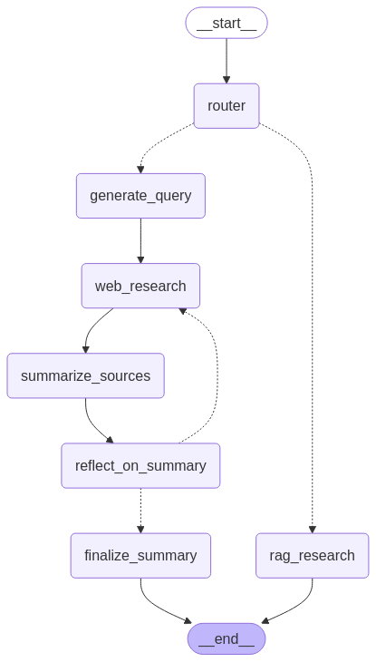

# RAG Research
This project is a simple implementation with a RAG system with YouTube data using LlamaIndex for efficient data retrieval and Qdrant or Chroma as the VectorDB to store and search the vectors. It also includes an optional Web Research Workflow that leverages real-time web data.

## RAG-Only Usage
- Replace `<query>` with your query and `<youtube_url>` with the YouTube URL.
    ```bash
    yt-dlp -f bestaudio --extract-audio --audio-format mp3 <youtube_url> -o "audio/audio.mp3"
    cd src/rag
    uv run whisper.py # Stop here if only want to load the data
    uv run rag.py --query <query> --path "../../qdrant" --collection "yt" --qdrant
    ```
- Explaination of args for `rag.py`:
    - `--query`: The query you want to search for
    - `--path`: The path to the VectorDB on disk
    - `--collection`: The collection name in the VectorDB
    - `--qdrant`: Use Qdrant as the VectorDB (default)
    - `--chroma`: Use Chroma as the VectorDB

### Using Cloud VectorDBs instead of Local VectorDBs
- if use [Qdrant](https://qdrant.com/) or [Pinecone](https://www.pinecone.io/) *(Note: not supported yet)*
    ```bash
    cp .env.example .env
    ```
    Copy your **QDRANT_API_KEY** and **QDRANT_URL** to the .env file

## Web Research Workflow
- This workflow adds RAG to the workflow implemented in [Ollama Deep Researcher](https://github.com/langchain-ai/ollama-deep-researcher), see it for more details.
- The RAG system is used on **hf_docs** dataset to answer the query by default
- Modify to use duckduckgo as the search API
- Graph Workflow:

    

### Usage
- Spin up [Ollama](https://github.com/ollama/ollama) server:
    ```bash
    ollama serve
    ```
    > **_NOTE:_** Pull the model you want first, for example: `ollama pull deepseek-r1:8b`

- See [Ollama Deep Researcher](https://github.com/langchain-ai/ollama-deep-researcher) for details on the environment variables.
    ```bash
    cp .env.example .env
    ```

- If want to use your YouTube data as the dataset for the RAG system, follow the steps in the [RAG-Only Usage](#rag-only-usage) section to load the data first. 
    > **_DON'T_** run the `rag.py` script.

- Run the workflow:
    ```bash
    uvx --refresh --from "langgraph-cli[inmem]" --with-editable . --python 3.11 langgraph dev
    ```
    > **_NOTE:_** in `graph.py`, in the `rag_research` function, see comments if you want to use mock rag data instead of the real data.

## Examples:
### hf_docs
- RAG-Only Usage:
    Uses the [HF Docs](https://huggingface.co/datasets/hf_docs) dataset
    ```bash
    cd src/rag
    uv run hf_docs.py
    uv run rag.py --query "How to create a pipeline object?" --path "../../qdrant" --collection "hf_docs" --qdrant
    ```
    See [llama3.1_hf_qdrant.txt](llama3.1_hf_qdrant.txt) for the output.
    
- Web Research Workflow:
    - uses `deepseek-r1:8b` model
    ```bash
    ollama pull deepseek-r1:8b
    ollama serve
    uvx --refresh --from "langgraph-cli[inmem]" --with-editable . --python 3.11 langgraph dev
    ```
    1. Prompt 1: What's Model Context Protocol?
        - See [output_What's Model Context Protocol?.md](output_What's%20Model%20Context%20Protocol%3F.md) for the output.
    2. Prompt 2: What are the FAANG companies?
        - See [output_What are the FAANG companies?.md](output_What%20are%20the%20FAANG%20companies%3F.md) for the output.
    3. Prompt 3: How to create a custom huggingface pipeline object?
        - See [output_How to create a custom huggingface pipeline object?.md](output_How%20to%20create%20a%20custom%20huggingface%20pipeline%20object%3F.md) for the output.

## Technologies Used for RAG System:
- [LlamaIndex](https://docs.llamaindex.ai/en/stable/)

- Embeddings (Loads from [HuggingFace](https://huggingface.co/)):
    - dense vectors: [gte-small](https://huggingface.co/thenlper/gte-small) 
    - sparse vectors: [Splade_PP_en_v1](https://huggingface.co/prithivida/Splade_PP_en_v1)

- VectorDBs:
    - Support Hybrid Vectors (dense + sparse)
        - [Qdrant](https://qdrant.tech/)
        - [Pinecone](https://www.pinecone.io/) *(Note: not supported yet)*
        > Note: sparse vectors defaults to [prithvida/Splade_PP_en_v1](https://huggingface.co/prithivida/Splade_PP_en_v1)
    - Dense Vectors: [Chroma](https://chroma.farfetch.com/)
    - Sparse Vectors: [BM25](https://docs.llamaindex.ai/en/stable/examples/retrievers/bm25_retriever)

- Reranker:
    - [bge-m3](https://huggingface.co/BAAI/bge-m3)

- Language Models (Loads from [HuggingFace](https://huggingface.co/)):
    - [Llama-3.1-8B-Instruct](https://huggingface.co/meta-llama/Llama-3.1-8B-Instruct)
    - [Llama-3.2-1B-Instruct](https://huggingface.co/meta-llama/Llama-3.2-1B-Instruct)
